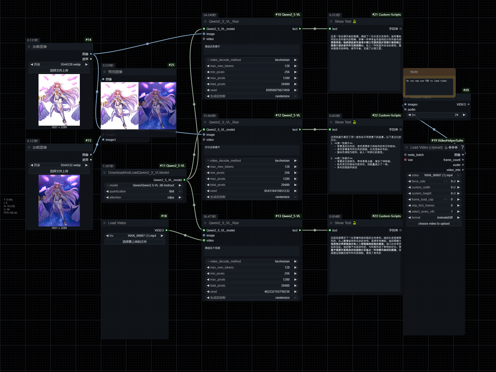

# Qwen2.5-VL in ComfyUI

[License: Apache License 2.0](https://github.com/QwenLM/Qwen2.5-VL/blob/main/LICENSE) from **[Qwen2.5-VL](https://github.com/QwenLM/Qwen2.5-VL)**

> 通义千问 2.5-视觉模型 VL 系列。

I have reviewed the existing comfyui-Qwen2.5-VL that are similar to this repo, and it seems that they do not provide native video input. The input method of `video_path` makes it unfriendly for some workflows, so I have written this repo.

Supports Type:

- Image
- Multi image
- Video
- Text Only

**most diff: Native Video input support, not PATH**

Sometimes when using too small a model or quantization, the model may speak nonsense, but in most cases it is normal. Please refer to the following example image:



**About Multi image:**

You can use any number of images to connect to the `BatchImageLoaderToLocalFiles` node for inference, or you can upload an animated type image (i.e. multiple batches of images like in the above example image).


Or you can freely add `image`, `video`, and `BatchImage` inputs, but this will cause the video to be parsed as an image (first frame), consistent with the test results on the [official website](https://chat.qwenlm.ai/).


## Installation:

Clone this repository to 'ComfyUI/custom_nodes` folder.

Install the dependencies in requirements.txt, transformers version 4.49.0 minimum is required:

`pip install -r requirements.txt`

or if you use portable (run this in ComfyUI_windows_portable -folder):

`python_embeded\python.exe -m pip install -r ComfyUI\custom_nodes\ComfyUI-Qwen2_5-VL\requirements.txt`

Supports most Qwen2.5-VL models, which can be automatically downloaded with the `DownloadAndLoadQwen2_5_VLModel` to `ComfyUI/models/VLM`:

```
"Qwen/Qwen2.5-VL-3B-Instruct",
"Qwen/Qwen2.5-VL-3B-Instruct-AWQ",
"Qwen/Qwen2.5-VL-7B-Instruct",
"Qwen/Qwen2.5-VL-7B-Instruct-AWQ",
"Qwen/Qwen2.5-VL-32B-Instruct",
"Qwen/Qwen2.5-VL-32B-Instruct-AWQ",
"Qwen/Qwen2.5-VL-72B-Instruct",
"Qwen/Qwen2.5-VL-72B-Instruct-AWQ",
```

node name：

- Qwen2_5-VL/DownloadAndLoadQwen2_5_VLModel
- Qwen2_5-VL/Qwen2_5_VL_Run
- Qwen2_5-VL/BatchImageLoaderToLocalFiles

<details>
<summary>Minimum VRAM requirements</summary>

| Precision | Qwen2.5-VL-3B | Qwen2.5-VL-7B | Qwen2.5-VL-72B |
| --------- | ------------- | ------------- | -------------- |
| FP32      | 11.5 GB       | 26.34 GB      | 266.21 GB      |
| BF16      | 5.75 GB       | 13.17 GB      | 133.11 GB      |
| INT8      | 2.87 GB       | 6.59 GB       | 66.5 GB        |
| INT4      | 1.44 GB       | 3.29 GB       | 33.28 GB       |

Note: The table above presents the theoretical minimum video memory requirements for inference with `transformers`; however, in practice, the actual memory usage is typically at least 1.2 times higher. For more information, see the linked resource [here](https://huggingface.co/docs/accelerate/main/en/usage_guides/model_size_estimator).

</details>

## Citation

```BibTeX

@article{Qwen2.5-VL,
  title={Qwen2.5-VL Technical Report},
  author={Bai, Shuai and Chen, Keqin and Liu, Xuejing and Wang, Jialin and Ge, Wenbin and Song, Sibo and Dang, Kai and Wang, Peng and Wang, Shijie and Tang, Jun and Zhong, Humen and Zhu, Yuanzhi and Yang, Mingkun and Li, Zhaohai and Wan, Jianqiang and Wang, Pengfei and Ding, Wei and Fu, Zheren and Xu, Yiheng and Ye, Jiabo and Zhang, Xi and Xie, Tianbao and Cheng, Zesen and Zhang, Hang and Yang, Zhibo and Xu, Haiyang and Lin, Junyang},
  journal={arXiv preprint arXiv:2502.13923},
  year={2025}
}

@article{Qwen2-VL,
  title={Qwen2-VL: Enhancing Vision-Language Model's Perception of the World at Any Resolution},
  author={Wang, Peng and Bai, Shuai and Tan, Sinan and Wang, Shijie and Fan, Zhihao and Bai, Jinze and Chen, Keqin and Liu, Xuejing and Wang, Jialin and Ge, Wenbin and Fan, Yang and Dang, Kai and Du, Mengfei and Ren, Xuancheng and Men, Rui and Liu, Dayiheng and Zhou, Chang and Zhou, Jingren and Lin, Junyang},
  journal={arXiv preprint arXiv:2409.12191},
  year={2024}
}

@article{Qwen-VL,
  title={Qwen-VL: A Versatile Vision-Language Model for Understanding, Localization, Text Reading, and Beyond},
  author={Bai, Jinze and Bai, Shuai and Yang, Shusheng and Wang, Shijie and Tan, Sinan and Wang, Peng and Lin, Junyang and Zhou, Chang and Zhou, Jingren},
  journal={arXiv preprint arXiv:2308.12966},
  year={2023}
}
```

<br>
